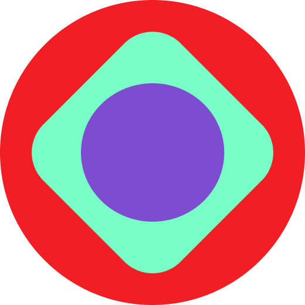

 </img>
## 👋 Привет! 

Меня зовут Катя и я ручной тестировщик. 

### Обо мне:

В прошлом горный инженер и тестировщик в настоящем. Обладаю аналитическим складом ума. Моим хобби является получение новых знаний. Стараюсь пробовать новое и внедрять полученный знания в работу. Верю в силу конструктивного общения и что обо всем можно договориться.

✉️ Связаться со мной:    

--- 

### Социальные сети: 

  
  

---
### 🗃 Тестовая документация:
📝  <a href="https://katye9470.kaiten.ru/space/58362" target="_blank"> Баг-отчеты </a>

📝  <a href="https://katye9470.kaiten.ru/space/58362" target="_blank"> Тест-кейсы </a>

  &nbsp
  &nbsp
  &nbsp
  &nbsp
  &nbsp

---
### 💻 Тестирование web: 

  &nbsp
  &nbsp
  &nbsp 

---
### 📱 Тестирование мобильных приложений: 

  &nbsp

---
### 🗄 Работа с данными:

  &nbsp
  &nbsp

---
### 🛠 Работа с кодом: 

  &nbsp
  &nbsp

